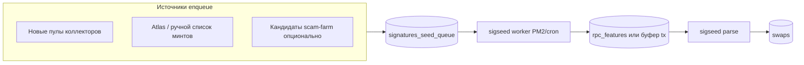

# W6.12 — S03 (execution): реализация Sigseed на ветке `v2`

**Тип:** исполнимая спецификация (implementation backlog)  
**Статус:** на `v2` контура sigseed **нет в коде**; нормативные цели — [`W6.12_S03_sigseed_bounded_swaps_ingest_spec.md`](./W6.12_S03_sigseed_bounded_swaps_ingest_spec.md). Этот документ фиксирует **что именно писать и в каком порядке**.  
**Зависимости:** [`W6.12_S01_unified_rpc_budget_counter_spec.md`](./W6.12_S01_unified_rpc_budget_counter_spec.md) (ledger уже есть: таблица `sa_qn_global_daily`, `scripts-tmp/sa-qn-global-budget-lib.mjs`), [`W6.13_budget_bot_reserve_detective_stable_spec.md`](./W6.13_budget_bot_reserve_detective_stable_spec.md) (доля бюджета под `sigseed_worker`).

---

## 1. Цель продукта

Дать **второй** (mint-scoped) источник строк **`swaps`** без `sa-stream`: очередь сигнатур/минтов → ограниченный RPC (`getSignaturesForAddress` / `getTransaction`) → парсинг → вставка в **`swaps`** с той же семантикой полей, что ожидает детектив (`rug_cohort`, `orchestrated_split`).

## 2. Текущий разрыв (anchor для агента)

- В репозитории **нет** npm-скриптов `sigseed:*`, worker’ов и миграций под `signatures_seed_queue` / `rpc_features` (поиск по репозиторию).
- В глобальном ledger уже зарезервирован `component_id`: **`sigseed_worker`** и env **`SA_SIGSEED_MAX_CREDITS_PER_DAY`** (см. `sa-qn-global-budget-lib.mjs`).
- RPC-обёртка для будущего worker: задел в `scripts-tmp/sa-qn-json-rpc.mjs` (комментарий в файле).

## 3. Архитектура (целевой поток)

**Правило:** каждый billable JSON-RPC в worker/parse проходит через **`qnGlobalReserveCredits` / refund** с `component_id: 'sigseed_worker'` и уважает **`SA_SIGSEED_MAX_CREDITS_PER_DAY`** и глобальный **`SA_QN_GLOBAL_CREDITS_PER_DAY`**.

## 4. Фазы реализации

### Фаза P0 — схема БД (миграция в схеме продукта)

1. Таблица очереди (имена на согласование с RUNTIME; минимум):
   - идентификатор задания, `mint` или `address` для подписей, `status` (`pending|processing|done|dead`), `priority`, `attempts`, `last_error`, `created_at`, `updated_at`.
2. Опционально таблица **`rpc_features`** (сырой слой до парсера) **или** хранение только `signature` + метаданные в очереди до успешного parse — выбрать один вариант и зафиксировать в миграции (избегать дублирования гигантских JSON в двух местах).
3. Индексы: выборка «следующий batch» по `status`, `priority`, `created_at`; уникальность пары (mint, lane) если нужно.

**Приёмка P0:** `npm run migrate` (или принятый в проекте способ) применяется на чистой схеме без ошибок.

### Фаза P1 — enqueue

1. CLI или cron: **`sigseed:enqueue`** — читает источник (конфигурируемый SQL/API/файл), применяет **дневной потолок** постановок (`ATLAS_ENQUEUE_MAX_PER_DAY` или новое имя `SA_SIGSEED_ENQUEUE_MAX_PER_DAY` — одно должно быть в `.env.example`).
2. Не ставить в очередь, если по минту уже достаточно строк в **`swaps`** (аналог `ATLAS_ENQUEUE_SWAPS_CEILING` из нормативной S03).
3. Логи: сколько записей поставлено, сколько отфильтровано лимитом.

**Приёмка P1:** dry-run режим (`SA_SIGSEED_ENQUEUE_DRY_RUN=1`) печатает план без записи в БД.

### Фаза P2 — worker

1. Процесс: **`scripts-tmp/sa-sigseed-worker.mjs`** (или `src/scripts/…` по конвенции репо), запуск **один инстанс** PM2 (или cron с lock в Postgres advisory lock).
2. Batch: забирает N задач; для каждой — ограниченное число страниц **`getSignaturesForAddress`** и выборочно **`getTransaction`**; учёт кредитов **до** вызова (как в оркестраторе).
3. При **`QN_GLOBAL_DAY_CAP`** или sigseed-дневном потолке — завершить batch, выставить задачам статус для повтора на следующий день (**без tight retry loop**).

**Приёмка P2:** интеграционный тест или ручной прогон на тестовом RPC с `SA_SIGSEED_MAX_CREDITS_PER_DAY=300` — расход не превышает потолок, ledger обновляется.

### Фаза P3 — parse → swaps

1. Использовать существующий путь парсинга свопов из RPC-транзакции (развести с текущим wallet-backfill: общий модуль, если уже есть).
2. Идемпотентная вставка в **`swaps`** (UNIQUE по паре signature/swap_key если принято в схеме).
3. Обновление статуса очереди `done` / `dead` с причиной.

**Приёмка P3:** для известной тестовой сигнатуры появляется строка в **`swaps`**, детективские запросы по `base_mint` видят данные.

### Фаза P4 — операционка

1. **`package.json`**: `sigseed:enqueue`, `sigseed:worker`, при необходимости `sigseed:parse` (если parse отдельным процессом).
2. **`ecosystem.config.cjs`**: процесс worker под `salpha`; cron enqueue — реже и уже чем wallet-backfill (согласовать с W6.13).
3. **`deploy/RUNTIME.md`**, **`.env.example`**: полная таблица env (очередь, лимиты, RPC URL для sigseed если отдельный endpoint).
4. **`SA_SIGSEED_MAX_CREDITS_PER_DAY`** включить в **`sa-qn-budget-check`** сумму операционных потолков (уже учитывается при ненулевом значении).

**Приёмка P4:** операторский чеклист «включить sigseed» из одного PR без ручных недокументированных шагов.

## 5. ENV (минимальный контракт — дополнить в `.env.example`)

| Переменная | Назначение |
|------------|------------|
| `SA_SIGSEED_ENABLED` | мастер-флаг worker/enqueue |
| `SA_SIGSEED_MAX_CREDITS_PER_DAY` | потолок компонента в ledger |
| `SA_SIGSEED_RPC_URL` | опционально; иначе общий QuickNode URL |
| `SA_SIGSEED_BATCH_SIZE`, `SA_SIGSEED_SIG_PAGES_MAX`, … | лимиты как у backfill (согласовать числа) |
| `SA_SIGSEED_ENQUEUE_MAX_PER_DAY` | потолок постановок |
| `SA_SIGSEED_*_DRY_RUN` | безопасные прогоны |

## 6. Non-goals

- Полный охват всех DEX в парсере — только то, что уже поддерживает общий parse-путь; расширение — отдельные задачи.
- Замена wallet-centric backfill (S02).

## 7. Критерии готовности «прод»

1. За сутки UTC суммарный ledger по `sigseed_worker` ≤ `SA_SIGSEED_MAX_CREDITS_PER_DAY` и ≤ глобального капа.
2. Глубина очереди стабилизируется (нет бесконечного роста из-за retry-storm).
3. `npm run sa-qn-budget-check` без противоречий после включения ненулевого `SA_SIGSEED_MAX_CREDITS_PER_DAY`.
4. Документ S03 normative обновлён ссылкой на этот execution-spec и фактическими именами таблиц/скриптов после merge.

---

**Связь с алертом QuickNode hourly:** клиентский счётчик в `src/core/rpc/solana-rpc-meter.ts` **не задаёт** 100 по умолчанию; часовой потолок включается только если **`QUICKNODE_HOURLY_CREDIT_BUDGET` > 0**. Sigseed должен использовать тот же контур учёта, что и остальные джобы (глобальный дневной ledger), а при необходимости сглаживания пиков — согласовать с оператором отдельное значение часового капа (см. раздел про Telegram в основном ответе).
