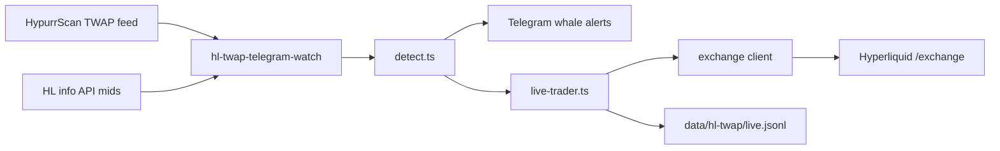

# HL TWAP — техническая архитектура (live)

> **Стратегия, направление сделок, тайминг, env, FAQ:** [`hl-twap.md`](./hl-twap.md)

## Data flow



## Module layout

```
src/hyperliquid/twap/
  normalize.ts           — HypurrScan row → sig.side (tw.b)
  detect.ts              — new/ended signals, crossing filter
  coin-twap-analysis.ts  — aggregate impact, entry plan, impact close
  twap-schedule.ts       — 30s slices, open/close timestamps
  format-telegram.ts     — whale alert HTML
  paper-trader.ts        — paper journal (optional)
  live/
    config.ts            — env
    coin-exposure.ts     — schedule gate, opposite-side block
    live-trader.ts       — schedule / open / ladder / close
    position-ladder.ts   — TP/DCA (margin ROE × leverage)
    exchange-hyperliquid.ts
    journal.ts           — live.jsonl
    telegram-notify.ts   — live trades channel
src/scripts/hl-twap-telegram-watch.ts  — main loop
```

## Side selection (code path)

1. `normalize.ts`: `tw.b ? 'buy' : 'sell'`
2. `detect.ts`: `sig.side === dominant` (crossing)
3. `scheduleLiveTrade`: `side: sig.side` in journal
4. `executeLiveOpen`: `marketOrder({ side: sched.side })`

No inversion anywhere. See [`hl-twap.md` §2](./hl-twap.md).

## Open validation

Before `executeLiveOpen`: TWAP still in feed + `computeCoinEntryPlan().allow` (re-check crossing).

## Tests

`tests/hl-twap-*.test.ts` — detect, crossing, ladder, exposure, schedule, format.

## Wallet

Live requires `HL_TWAP_LIVE_PRIVATE_KEY` in **`.env` only** (not PM2 env). Prefer HL API wallet key. Details in [`hl-twap.md`](./hl-twap.md).
