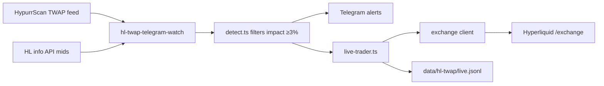

# Hyperliquid TWAP Live Bot — Architecture

Automated perp trader that follows whale TWAPs on Hyperliquid. Default mode is **dry-run** until `HL_TWAP_LIVE_PRIVATE_KEY` is provided.

## Data flow



## Entry / exit timing

Reuses `computeTwapSchedule()` from paper trading:

| Event | When |
|-------|------|
| **Open** | After 1st 30s TWAP slice |
| **Close** | Before last slice |
| **Cancel** | Full close (or drop pending schedule) |

Notional: **$100 margin** per signal (`HL_TWAP_LIVE_NOTIONAL_USD`) × leverage → gross position (e.g. $500 at 5x).

## In-position ladder (±3% from **average entry**)

Reference price = **current average entry** (`avgEntryPx`). After each DCA the average moves, so +3% TP is reached sooner in price terms than vs the first fill alone.

| Trigger | Action | Size |
|---------|--------|------|
| +3%, +6%, +9%… vs **avg** | Take profit | 10% of **initial** notional each level |
| −3%, −6%, −9%… vs **avg** | Add / DCA | 10% of **initial** notional each level |

Partial TP does not change avg on HL (size down only); DCA updates avg via weighted fill price.

## One position per TWAP signal

- Each qualifying TWAP (`hash`) → separate live position at `HL_TWAP_LIVE_NOTIONAL_USD` (default $100).
- Same coin, **same side**: multiple TWAPs stack (independent schedules / closes).
- Same coin, **opposite side**: blocked while any position is open (perps net long+short).
- Opposite TWAP that removes net edge (≤3%) → close **all** open positions on that coin for the losing side.

## Module layout

```
src/hyperliquid/twap/live/
  config.ts           — env parsing
  types.ts            — positions, exchange interface
  position-ladder.ts  — ±3% TP/DCA logic (unit tested)
  coin-exposure.ts    — one-coin policy (unit tested)
  journal.ts          — live.jsonl persistence
  exchange-dry-run.ts — log-only orders (default)
  exchange-hyperliquid.ts — @nktkas/hyperliquid IoC orders
  exchange-client.ts  — factory
  live-trader.ts      — schedule / open / ladder / close
```

## Environment

| Variable | Default | Purpose |
|----------|---------|---------|
| `HL_TWAP_LIVE_ENABLED` | `0` | Turn on live path in watch |
| `HL_TWAP_LIVE_DRY_RUN` | `1` | Simulate orders (no key needed) |
| `HL_TWAP_LIVE_PRIVATE_KEY` | — | EVM key for HL wallet |
| `HL_TWAP_LIVE_NOTIONAL_USD` | `100` | Margin (collateral) per TWAP; gross size = margin × leverage |
| `HL_TWAP_LIVE_MIN_IMPACT_PCT` | `3` | Min impact for new entries |
| `HL_TWAP_LIVE_LADDER_STEP_PCT` | `3` | TP/DCA step |
| `HL_TWAP_LIVE_LADDER_SLICE_PCT` | `10` | Slice size (% of initial) |
| `HL_TWAP_LIVE_LEVERAGE` | `5` | Cross leverage per asset (capped to HL max per coin, e.g. REZ 3x → $300 from $100 margin) |
| `HL_TWAP_LIVE_TESTNET` | `0` | Use HL testnet |
| `HL_TWAP_LIVE_JSONL` | `data/hl-twap/live.jsonl` | Journal path |

## Go-live checklist

1. Fund the Hyperliquid account with **USDC margin** (perps).
2. Provide a **private key** that can **sign** orders (see Wallet security below) — a public address alone is not enough and cannot be used to trade.
3. Set on the server (`.env` or PM2 env, never commit):  
   `HL_TWAP_LIVE_ENABLED=1`, `HL_TWAP_LIVE_DRY_RUN=0`, `HL_TWAP_LIVE_PRIVATE_KEY=0x…`
4. `pm2 reload ecosystem.config.cjs --only hl-twap-telegram-watch --update-env`
5. Monitor `data/hl-twap/live.jsonl` and positions on [app.hyperliquid.xyz](https://app.hyperliquid.xyz).

## Wallet security (what to give the bot)

| What | Can trade? | Give to bot? |
|------|------------|--------------|
| **Public address** (0x…) | No — read-only for others | Optional (for dashboard display only) |
| **Private key** (0x secret) | **Yes** — signs every order | **Required for live** — server env only |

Anyone can copy your **public** address; they **cannot** place trades without the **private** key (or an HL **API wallet** key you authorized for trading).

**Recommended:** create a Hyperliquid **API wallet** (agent) in the HL UI, fund the main account, authorize the API wallet for **trade only** (no withdraw). Put **only the API wallet private key** in `HL_TWAP_LIVE_PRIVATE_KEY`, not your main wallet key. Rotate/revoke the API wallet in HL if the VPS is compromised.

Never commit keys to git or Telegram. We only need the signing key on kvm2 in `.env` — you do not paste it in chat if you prefer; SSH and add it yourself, then we flip `DRY_RUN=0`.
