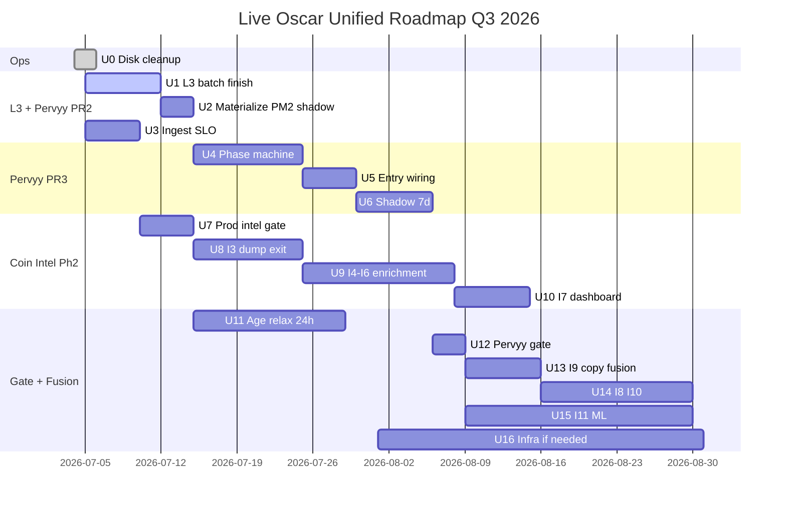

# Live Oscar — единая дорожная карта Q3 2026

**Продукт:** `solana-alpha` / PM2 `live-oscar`  
**Ветка:** `v2`  
**Статус:** normative (единственный sequential roadmap для команды)  
**Версия:** 1.1 (2026-07-04)

> **Канонический roadmap.** Детали по фичам — в спеках:
> - [`LIVE_OSCAR_COIN_INTELLIGENCE_SPEC.md`](./LIVE_OSCAR_COIN_INTELLIGENCE_SPEC.md) — L0–L4, I1–I11, rollout flags
> - [`LIVE_OSCAR_PERVYY_VYSTREL_SPEC.md`](./LIVE_OSCAR_PERVYY_VYSTREL_SPEC.md) — tier «Первый выстрел», PR1–PR3, §17 infra

**Синтез предшествующих сессий:** subagent c60eef93 (merge request), af6a5611 (hYhqi forensics, L3 positive gate), 8723f48e (infra sequencing §17).

---

## 1. Цель

Одна **последовательная** дорожная карта Live Oscar на **Q3 2026**, объединяющая:

- **Coin Intelligence / Wallet Intel** (superpowers I1–I11 + shared L3 batch),
- **Runner lanes** (`runner_lite` = phase 1 intel wiring),
- **«Первый выстрел»** (PR1–PR3),
- **Ops hygiene** (диск/VPS — не блокер кода, но блокер batch jobs).

Команда **не ведёт параллельные треки** в разных § roadmap; каждый шаг имеет ID, источник, зависимости и критерий done.

**Принцип порядка:** ingest и shared L3 batch **до** hard gate First Shot; PR3 = **phantom/replay Phase D**, не live entry; Coin Intel Phase 2 exit/enrichment **параллельно не смешивается** с Pervyy gate — но **общий L3 слой** строится один раз (PR2 = L3 для обоих).

**Жёсткий no-live-buy gate:** до отдельного operator sign-off **запрещены live buys** по `pervyy_vystrel`. Продвижение возможно только после Phase C/D replay с **положительным PnL**, подтверждённым **bottom catch** на shadow candidates, и явной проверки: (1) **cluster dump completed**, (2) **fresh retail absorption**, (3) **re-ramp confirmation**. LojakPaul-style falling knife (падение без свежего retail absorption/re-ramp) должен получать reject, а не entry.

---

## 2. Уже shipped (кратко)

| Что | Источник | Статус |
|-----|----------|--------|
| **`runner_lite` lane** | Intel phase 1 / CHANGELOG 1.11.545+ | ✅ prod: 2×$100, mcap $500k–<$1M, `half8_runner` exit |
| **I1 Wallet-intel mint gate** | Coin Intel MVP | ✅ `oscar-intel-gate.ts`; **gate** на `runner_probe` / `runner_lite`; **shadow** на prod Oscar |
| **I2 Scam-farm / meta-cluster tags** | subset I1 | ✅ via `wallet_intel_decisions` + tags |
| **Intel Telegram notify** | ops hotfix | ✅ `live-oscar-intel-notify.ts` — ADVICE при tier pass + intel block |
| **Ephemeral neighbor-window** | Coin Intel baseline | ✅ 1.11.545 known-repeat mint fix |
| **PR1 «Первый выстрел»** | Pervyy §10 | ✅ discovery floor $100k, volume-leader inject, env contract, journal kinds, `pervyy-vystrel-pr1` tests |
| **PR2 код (partial)** | Pervyy §10 PR2 | ⚠️ модули в дереве: `mint-organic-flow-gate`, `mint-volume-authenticity`, `mint-early-cluster-map`, `pervyy-vystrel-materialize`; **PM2 worker OFF**, PG table optional (file cache), **нет 7d shadow evidence** |
| **PR3 skeleton (partial)** | Pervyy §10 PR3 | ⚠️ shadow observability в `dip-clones` (Phase 0 onboard only); **нет** persistent watchlist, Phase A–D machine, entry, `exit-policy-pervyy` |

---

## 3. Единая последовательность шагов

### U0 — Ops: disk hygiene на VPS

| | |
|---|---|
| **ID** | `U0` |
| **Название** | Освобождение диска (~25–31G) без потери prod journal |
| **Источник** | Pervyy §17.6 Tier 0 / ops |
| **Зависимости** | — (блокирует sustained batch jobs при >75% disk) |
| **Критерий done** | `/` usage **≤55%**; удалены stale `.bak-world-*`, ротация `hl-twap-telegram-watch-out.log`, PG backup retention ≤3 on-box; зафиксирован `df -h` в ops note |
| **Сложность** | **S** |

**Подзадачи:** stale JSONL backup, PM2 logrotate, bscpulse audit, PG backup offload.

---

### U1 — Shared L3 batch: organic flow + vol-auth + cluster snapshot

| | |
|---|---|
| **ID** | `U1` |
| **Название** | Завершить PR2: единый L3 materialize layer |
| **Источник** | Pervyy PR2 · Coin Intel L3 · Intel **L3** (§2.1) |
| **Зависимости** | U0 (рекомендуется); PR1 ✅ |
| **Критерий done** | `mint-organic-flow-gate`, `mint-volume-authenticity`, `mint-early-cluster-map` — unit tests green; optional PG tables **или** стабильный file cache contract; `wallet-intel:doctor` pass на 20 pump mints; документирован cache path + TTL |
| **Сложность** | **M** |

**Включает (sub-bullets, не отдельные треки):**

- **L3** `mint_organic_flow_snapshot` — unique buyers, cluster_buyer_ratio (Pervyy §5.3, §14)
- **§6.4** volume authenticity — wash_score / organic_score / `authentic_pass`
- **§6.1** early buyer cluster map — `entity_wallets` + `money_flows` 1-hop
- Задел под **I7** `mint_intel_cache` (payload jsonb per mint) — тот же worker, не второй pipeline

---

### U2 — Enable materialize worker (shadow)

| | |
|---|---|
| **ID** | `U2` |
| **Название** | PM2 `pervyy-vystrel-materialize` — shadow cadence 15m |
| **Источник** | Pervyy PR2 · Pervyy §17 Option B |
| **Зависимости** | U1 |
| **Критерий done** | `PERVYY_VYSTREL_MATERIALIZE_ENABLED=1`; cache refresh ≤15m для watchlist mints; journal `pervyy_vystrel_vol_auth_snapshot` / `organic_flow_shadow` на ≥80% pump alerts (3d); eval tick **0 SQL** (cache hit only) |
| **Сложность** | **S** |

---

### U3 — Ingest health gate для micro-cap

| | |
|---|---|
| **ID** | `U3` |
| **Название** | Collector/sigseed SLO: snapshot ≤15m, swaps ≤2h |
| **Источник** | Pervyy §5.2 · af6a5611 (hYhqi FN) · ops |
| **Зависимости** | PR1 ✅ |
| **Критерий done** | Forensic script / doctor check: 20 последних pump onboard → `count(*) pumpswap_pair_snapshots > 0`; swaps coverage ≥70% mints с vol1h≥$50k; RUNTIME.md note |
| **Сложность** | **M** |

---

### U4 — PR3: persistent watchlist + phase machine (A–D)

| | |
|---|---|
| **ID** | `U4` |
| **Название** | Phantom/replay state machine «Первый выстрел» (не live entry) |
| **Источник** | Pervyy PR3 · §3 |
| **Зависимости** | U1, U2 |
| **Критерий done** | In-memory + optional PG `pervyy_vystrel_watch`; transitions Phase 0→A→B→C→D; journal kinds `phase_a_tick`, `surveillance_tick`, `cluster_dump_confirmed`, `phase_c_candidate`, `phase_d_candidate`, `dump_retail_skipped`; **pass:false**, `would_enter:false` (phantom/replay only) |
| **Сложность** | **L** |

**Sub-bullets:** Phase C cluster attribution (§6.2); Phase D gates D1–D10 read from materialized cache; whale-analysis integration §6.3.

---

### U5 — PR3: phantom replay wiring + no-open guard

| | |
|---|---|
| **ID** | `U5` |
| **Название** | Replay surface: `mint::pervyy_vystrel`, no `live_position_open` |
| **Источник** | Pervyy PR3 · §7–§8 |
| **Зависимости** | U4 |
| **Критерий done** | `resolveOpenMapKey` suffix `::pervyy_vystrel` documented only; staged 2×$25 remains future sizing; no call path to `live_position_open`; **MODE=shadow / ENABLED=0** emits Phase D phantom journal only (`pass:false`, `would_enter:false`) |
| **Сложность** | **M** |

---

### U6 — Pervyy full shadow S2 (7d)

| | |
|---|---|
| **ID** | `U6` |
| **Название** | «Первый выстрел» shadow evidence перед gate |
| **Источник** | Pervyy §13 |
| **Зависимости** | U2, U4, U5 |
| **Критерий done** | `PAPER_PERVYY_VYSTREL_ENABLED=1`, `MODE=shadow` ≥7d; eval p95 <200ms; ≥10 `cluster_dump_confirmed` / Phase C candidates; Phase D candidates show **positive replay PnL** and bottom-catch quality; manual FP/FN review; hYhqi replay → Phase C/D confirm **when PG data exists** |
| **Сложность** | **S** (calendar time) |

---

### U7 — Coin Intel: prod Oscar wallet gate shadow→gate

| | |
|---|---|
| **ID** | `U7` |
| **Название** | I1 promotion на main prod lane |
| **Источник** | Coin Intel §7–§8 MVP · I1 |
| **Зависимости** | U3 (swap coverage); runner_lite/probe gate ✅ |
| **Критерий done** | `LIVE_OSCAR_INTEL_MODE=gate` на prod после ≥48h shadow; `intel_gate_block_rate` + FP samples в journal; discovery p95 intelMs <150ms; `wallet-intel:doctor` pre-promotion |
| **Сложность** | **S** |

**Sub-bullets:** I2 уже в I1; не дублировать.

---

### U8 — Coordinated dump exit overlay (I3)

| | |
|---|---|
| **ID** | `U8` |
| **Название** | Exit-side coordinated dump — shadow → gate |
| **Источник** | Coin Intel **I3** · §8.3 |
| **Зависимости** | U7 (entry intel stable) |
| **Критерий done** | `LIVE_OSCAR_INTEL_EXIT_DUMP_ENABLED=1`; reuse whale group_sell on open positions; 7d shadow без tracker tick regression; optional link Pervyy §8.2 `cluster_dump_exit` mode |
| **Сложность** | **M** |

---

### U9 — Holder concentration + dip_bot + whale exit (I4, I5, I6)

| | |
|---|---|
| **ID** | `U9` |
| **Название** | Phase 2 entry/exit enrichment batch |
| **Источник** | Coin Intel **I4**, **I5**, **I6** |
| **Зависимости** | U1 (L3 batch); U8 (exit path exists) |
| **Критерий done** | I4: batch top-holder gate (no live RPC discovery tick); I5: dip_bot advisory→block shadow; I6: whale exit group dump while holding; все sub-flags default-OFF → shadow ≥7d each |
| **Сложность** | **L** |

---

### U10 — mint_intel_cache + operator dashboard (I7)

| | |
|---|---|
| **ID** | `U10` |
| **Название** | Observability: per-mint intel payload + dashboard |
| **Источник** | Coin Intel **I7** |
| **Зависимости** | U1, U9 |
| **Критерий done** | Table/cache `mint_intel_cache` refreshed 4h; dashboard badge / hourly counters `intel_gate_blocks_24h`, `pervyy_vystrel_watch_count`; operator can inspect mint without ad-hoc SQL |
| **Сложность** | **M** |

---

### U11 — Age relaxation lanes 24h / 12h

| | |
|---|---|
| **ID** | `U11` |
| **Название** | Intel-gated age gate relaxation |
| **Источник** | Coin Intel §4.3 |
| **Зависимости** | U7 (I1 gate on prod); U6 recommended (Pervyy shadow green) |
| **Критерий done** | `LIVE_OSCAR_INTEL_AGE_RELAX_ENABLED=1` only after 7d shadow per cohort; `PAPER_POST_MIN_AGE_MIN=1440` (24h) first; 12h (`720`) — operator sign-off; kill switch tested |
| **Сложность** | **M** |

---

### U12 — «Первый выстрел» gate mode

| | |
|---|---|
| **ID** | `U12` |
| **Название** | Pervyy PR3 S4: shadow → gate |
| **Источник** | Pervyy §13 · PR3 |
| **Зависимости** | U6; U3; U7 |
| **Критерий done** | `PAPER_PERVYY_VYSTREL_MODE=gate` only after separate sign-off; Phase C/D replay positive PnL; bottom catch confirmed on shadow candidates; LojakPaul-style falling knife rejected; FP manual review ≤20% would_enter; exposure cap 4×$50 enforced; Telegram ADVICE 48h optional (S3) |
| **Сложность** | **S** |

**Sub-bullets:** D7 intel denylist green; D10 vol-auth hard gate; organic gate enabled; no live buys before replay evidence.

---

### U13 — Copy-trader intel fusion (I9)

| | |
|---|---|
| **ID** | `U13` |
| **Название** | Shared mint intel cache для copy-trader |
| **Источник** | Coin Intel **I9** · §10 |
| **Зависимости** | U10; U12 |
| **Критерий done** | Rules F1–F5 implemented; `COPY_TRADER_INTEL_GATE_ENABLED` shadow→gate; entry block on mint blocks copy leg; exit follow default OFF |
| **Сложность** | **M** |

---

### U14 — SMART_TIER quorum + meta-cluster v2 (I8, I10)

| | |
|---|---|
| **ID** | `U14` |
| **Название** | Phase 3 optional smart path + batch graph |
| **Источник** | Coin Intel **I8**, **I10** |
| **Зависимости** | U7, U13 |
| **Критерий done** | I8: optional size bump, never override BLOCK; I10: cross-mint operator graph batch-only; operator sign-off FP/FN |
| **Сложность** | **M** |

---

### U15 — ML / journal calibration (I11)

| | |
|---|---|
| **ID** | `U15` |
| **Название** | Offline FP/FN calibration по journal |
| **Источник** | Coin Intel **I11** · backlog |
| **Зависимости** | U6, U7, U12 (≥30d journal) |
| **Критерий done** | Counterfactual report `% blocked mints +PnL`; threshold tuning proposal; **не** auto-deploy без operator |
| **Сложность** | **L** |

---

### U16 — Infra escalation (Option B / C′)

| | |
|---|---|
| **ID** | `U16` |
| **Название** | PM2 split или batch-only VPS при contention |
| **Источник** | Pervyy §17 · ops |
| **Зависимости** | U2 running; triggers only |
| **Критерий done** | **Option B:** separate PM2 if materialize p95 >200ms post-U0; **Option C′:** KVM1 ~$7/mo batch + RO PG if steal >35% sustained / load >10; **не** full repo clone unless mandate |
| **Сложность** | **M** |

---

## 4. Логика порядка

```text
U0 ops disk
  → U1 shared L3 batch (PR2 core)     ← один pipeline для Coin Intel L3 + Pervyy
  → U2 enable materialize worker
  → U3 ingest SLO                     ← без этого hYhqi-class 100% FN
  → U4–U5 PR3 code (phantom/replay)    ← только после L3 cache exists; no live entry
  → U6 Pervyy 7d shadow
  ∥ U7 prod intel gate promotion      ← runner_lite/probe уже gate; main prod отстаёт
  → U8–U10 Coin Intel Phase 2 (I3–I7) ← exit/enrichment; I7 переиспользует U1 cache
  → U11 age relax                     ← только при I1 gate green + shadow cohorts
  → U12 Pervyy gate                   ← only after positive C/D replay PnL + bottom catch
  → U13–U14 fusion + smart (I8–I10)
  → U15 I11 offline
  → U16 infra if triggers
```

**Ключевые решения (из af6a5611 / §17):**

1. **Shared L3 before First Shot gate** — positive organic gate (L3) блокировал Phase A; дублировать batch для Intel и Pervyy запрещено.
2. **PR3 after PR2 materialize enabled** — tick path cache-only (§6.4.3); phase machine без snapshots = shadow theatre.
3. **runner_lite = Intel phase 1** — denylist gate shipped; Phase 2 = I3–I7 exit/enrichment, не повтор I1.
4. **Disk cleanup ≠ architecture fork** — U0 обязателен до U2; отдельный VPS (U16) только по triggers §17.6.
5. **Hotfix vs roadmap** — wallet TG notify, ephemeral fix — shipped; не смешивать с U-steps (§6).

---

## 5. Timeline (Mermaid)



---

## 6. Что НЕ смешивать с roadmap steps

| Тип | Примеры | Как вести |
|-----|---------|-----------|
| **Prod hotfix** | intel TG notify, ephemeral neighbor-window, wallet balance SoT patch | Ship через `v2` + CHANGELOG; **не** новый U-step |
| **Spec-only doc** | правки § без кода | Не меняет порядок U1–U16 |
| **Platform VERSION** | `docs/platform/**` | Вне scope; не bump за product roadmap |
| **Emergency env rollback** | `INTEL_MODE=off`, `PERVYY_ENABLED=0` | §3.3 / §13.2 kill switches — не roadmap regression |
| **Full VPS clone (Option C)** | duplicate ingest | **Запрещено** по default §17.5; только U16 trigger + mandate |
| **Parallel «Intel track» vs «Pervyy track»** | два PM2 pipeline для L3 | Запрещено — только U1 shared batch |

---

## 7. Маппинг intel items → unified steps

| Intel ID | Фича | Unified step |
|----------|------|----------------|
| I1 | Wallet-intel mint gate | ✅ Shipped · **U7** prod promotion |
| I2 | Scam-farm tags | ✅ Shipped (subset I1) |
| L3 | Organic flow positive gate | **U1**, **U2** |
| I3 | Coordinated dump exit | **U8** |
| I4 | Holder concentration | **U9** |
| I5 | Dip_bot advisory | **U9** |
| I6 | Whale exit enhancement | **U9** |
| I7 | mint_intel_cache + dashboard | **U1** (cache), **U10** (dashboard) |
| I8 | SMART_TIER quorum | **U14** |
| I9 | Copy-trader fusion | **U13** |
| I10 | Cross-mint graph v2 | **U14** |
| I11 | ML calibration | **U15** |
| — | runner_lite lane | ✅ Shipped (Intel phase 1) |
| — | Pervyy PR1 | ✅ Shipped |
| — | Pervyy PR2 | **U1–U2** (partial → done) |
| — | Pervyy PR3 | **U4–U6**, **U12** |

---

## 8. Версионирование документа

| Версия | Дата | Изменение |
|--------|------|-----------|
| 1.1 | 2026-07-04 | Уточнён PR3: Phase D phantom/replay only; no live buys до positive C/D replay PnL + bottom-catch evidence; falling-knife reject критерии |
| 1.0 | 2026-07-04 | Первая unified roadmap: merge Coin Intel §8 + Pervyy PR1–PR3 + §17 ops |

---

*Продукт: solana-alpha only. Cross-product changes: none. Platform VERSION: не меняется.*
